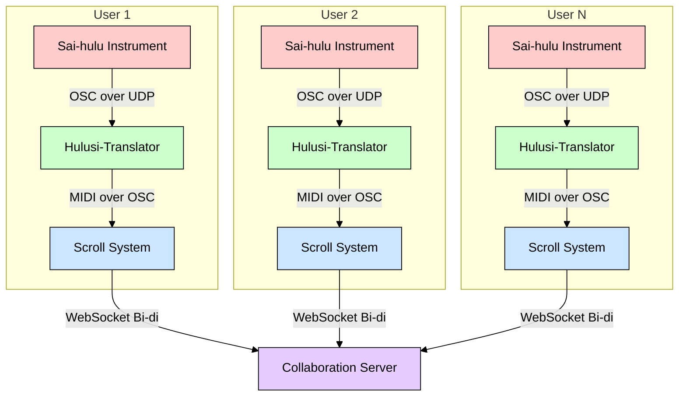

# Sai-Hulu Project 赛葫芦计划

## General Description

Sai-hulu Project is a hacking-hulusi project aiming for helping elderly playing music together(online and offline).

Our system contains three parts: 1.the hardware modification of hulusi, we call it Sai-hulu Instrument(the hacked hulusi, the name was targeted to be able to be capable of cross-culture/ideology iterpretation 赛葫芦) and 2. the scroll system(running on a computer) and 3.hulusi-transolator which translate the Sai-hulu Instrument signal(OSC over UDP) top.

When the user turn on the Sai-hulu Instrument, the instrument will communicate with the hulusi translator, and then tranlated into MIDI format wrapped in osc then push it to the scroll system. Each of the user will be using one Sai-hulu instrument, and assuming to be viewing the scroll system at the same time, which means the scroll system will be bind with the Sai-hulu instrument on a individual user base, and be viewed by one specific user. In other words, For each user, it will have two interfaces: 1. one Sai-hulu instrument (to play the instrument as the same way playing hulusi of course) 2. one scroll system to view the scroll, playing history(from the player itself and from others) and also other collobration(such as start the dynamic bar playing cross all the human saihulu instrument players)

As the design of the scroll system was, by nature, targeting collobration among multiple users, the score system will work as a musical "chatroom", process the info of the inputs and distrubute(through websocket) to other clients who are viewing the scroll. So the user would be able to play at the same time online and synchonized their playing together and view their own/other player performance(by using the scroll system webapp).

## System Overview

## TODO

[x] Fix the re-triggering

[x] The release retrigger functionality 

[x] write a simple system overview

[] write proper documentation 
